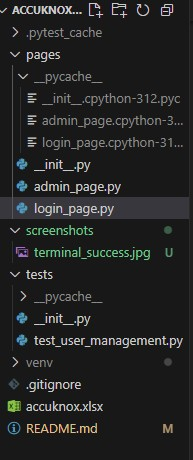
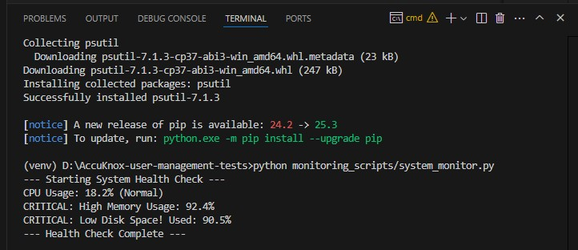
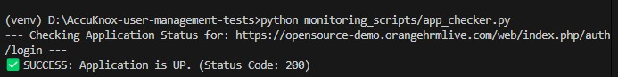
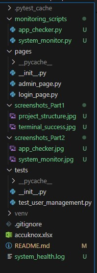

# # AccuKnox User Management Automation

This project contains the automation script for the **User Management E2E Flow** of the OrangeHRM demo application.

## Project Details
- **Repository Name:** AccuKnox-user-management-tests
- **Language:** Python
- **Automation Tool:** Playwright (Version 1.49+)
- **Test Framework:** Pytest
- **Design Pattern:** Page Object Model (POM)

## Test Scenarios Covered
This project covers 6 End-to-End scenarios (Manual & Automated):
1. **Navigate to Admin Module:** Verify access to the system users page.
2. **Add New User:** Create a new login linked to an existing employee.
3. **Search User:** Verify the system can filter and find the newly created user.
4. **Edit User:** Update the user's role (e.g., from Admin to ESS).
5. **Validate Updates:** Confirm changes are reflected in the data grid.
6. **Delete User:** Remove the user and verify they no longer exist in search results.

## Prerequisites
- **Python 3.8+**
- **Node.js** (Required for Playwright browser binaries)

## Installation & Setup
1. **Clone the repository:**
   ```bash
   git clone [https://github.com/KumarSwarnim19/AccuKnox-user-management-tests.git](https://github.com/KumarSwarnim19/AccuKnox-user-management-tests.git)
   
   cd AccuKnox-user-management-tests


2. Create a Virtual Environment (Optional but Recommended):
   ```bash
   python -m venv venv

   venv\Scripts\activate
   ```
3. Install Dependencies:
   ```bash
   pip install pytest-playwright

   playwright install
   ```
## How to Run the Tests

1. Run in Headed Mode (Visible Browser):

This runs the test with a 1-second pause between actions for better visibility.

   ```bash
   pytest tests/test_user_management.py --headed --slowmo 1000
   ```
2. Run in Headless Mode (Background):

   ```bash
   pytest tests/test_user_management.py
   ```

## Project Structure   
### 1. Directory Breakdown
The project follows a standard **Pytest + Playwright** structure, separating the Page Objects, Test Scripts, and Test Data for maintainability.
```text
AccuKnox-user-management-tests/
├── pages/                      # Page Object Model (POM) Classes
│   ├── login_page.py           # Handles Login Page interactions
│   └── admin_page.py           # Handles Admin Dashboard & User Management
│
├── tests/                      # Test Execution Scripts
│   └── test_user_management.py # Main E2E Automation Script
│
├── accuknox.xlsx               # Manual Test Case Document (Excel)
└── README.md                   # Project Documentation
```

## Source Code Implementation

1. Login Page Object (`pages/login_page.py`)
This class handles the authentication logic, isolating the login selectors.

```python
from playwright.sync_api import Page

class LoginPage:
    def __init__(self, page: Page):
        self.page = page
        self.username_input = page.locator("input[name='username']")
        self.password_input = page.locator("input[name='password']")
        self.login_button = page.locator("button[type='submit']")

    def navigate(self):
        # Go to the OrangeHRM Login URL
        self.page.goto("[https://opensource-demo.orangehrmlive.com/web/index.php/auth/login](https://opensource-demo.orangehrmlive.com/web/index.php/auth/login)")

    def login(self, username, password):
        # Fill in the credentials and click login
        self.username_input.fill(username)
        self.password_input.fill(password)
        self.login_button.click()
```

2. Admin Page Object (pages/admin_page.py)

   This class encapsulates all complex interactions within the Admin module, including adding, searching, editing, and deleting users.

```python
import re
from playwright.sync_api import Page, expect

class AdminPage:
    def __init__(self, page: Page):
        self.page = page
        # --- Selectors ---
        self.admin_menu_link = page.locator("text=Admin")
        self.add_button = page.locator("button:has-text(' Add ')")
        self.save_button = page.locator("button[type='submit']")
        self.success_toast = page.locator(".oxd-toast")
        
        # Search Selectors
        self.search_username_input = page.locator("form input.oxd-input").nth(0)
        self.search_button = page.locator("button[type='submit']")
        self.reset_button = page.locator("button:has-text(' Reset ')")

    def navigate_to_admin(self):
        self.admin_menu_link.click()
        # Use re.compile to match the URL correctly
        expect(self.page).to_have_url(re.compile("viewSystemUsers"))

    def add_user(self, username, password, employee_hint="a"):
        # Ensure we are on the right page before clicking Add
        if "viewSystemUsers" not in self.page.url:
            self.navigate_to_admin()
            
        self.add_button.click()
        
        # 1. Select User Role: Admin
        self.page.locator(".oxd-select-text").nth(0).click()
        self.page.locator("role=option[name='Admin']").click()
        
        # 2. Select Status: Enabled
        self.page.locator(".oxd-select-text").nth(1).click()
        self.page.locator("role=option[name='Enabled']").click()
        
        # 3. Employee Name (Selects first hint)
        type_hint = self.page.locator("input[placeholder='Type for hints...']")
        type_hint.click()
        type_hint.fill(employee_hint)
        
        # Wait specifically for the dropdown options to appear
        self.page.wait_for_selector("div[role='listbox']", state="visible")
        self.page.wait_for_timeout(1000) # Small wait to ensure stability
        
        # Click the first option that appears
        self.page.locator("div[role='listbox'] div[role='option']").first.click()
        
        # 4. Username & Password
        self.page.get_by_role("textbox").nth(2).fill(username) 
        self.page.locator("input[type='password']").nth(0).fill(password)
        self.page.locator("input[type='password']").nth(1).fill(password)
        
        # Click Save
        self.save_button.click()
        
        # Wait for the toast or URL change to confirm success
        self.page.wait_for_url(re.compile("viewSystemUsers"), timeout=10000)

    def search_user(self, username):
        # Ensure we are on the list page
        if "viewSystemUsers" not in self.page.url:
            self.navigate_to_admin()

        self.page.wait_for_timeout(2000) 
        
        # Clear previous search if any (using Reset)
        self.reset_button.click()
        self.page.wait_for_timeout(1000)

        # Type the username in the search box
        self.page.get_by_role("textbox").nth(1).fill(username)
        self.search_button.click()
        
        # Wait for the record to appear
        self.page.wait_for_selector(f"div.oxd-table-card:has-text('{username}')", timeout=10000)

    def edit_user_role(self, username, new_role="ESS"):
        # Click Pencil Icon for the specific user
        self.page.locator(f"div.oxd-table-card:has-text('{username}') .bi-pencil-fill").click()
        
        self.page.wait_for_timeout(1000)
        
        # Change Role to ESS
        self.page.locator(".oxd-select-text").nth(0).click()
        self.page.locator(f"role=option[name='{new_role}']").click()
        
        self.save_button.click()
        self.page.wait_for_url(re.compile("viewSystemUsers"))

    def delete_user(self, username):
        # Click Trash Icon for the specific user
        self.page.locator(f"div.oxd-table-card:has-text('{username}') .bi-trash").click()
        
        # Click "Yes, Delete" on the popup
        self.page.locator("button:has-text(' Yes, Delete ')").click()
        
        # Wait for success toast
        expect(self.success_toast).to_be_visible()
```

3. Test Script (tests/test_user_management.py)

   The main execution file that links the page objects to run the End-to-End flow.
```python
import pytest
from playwright.sync_api import Page
from pages.login_page import LoginPage
from pages.admin_page import AdminPage

# We define the user data here
TEST_USER = "NewUser"
TEST_PASS = "admin123!"

def test_orangehrm_e2e(page: Page):
    # Initialize our Page Objects
    login_p = LoginPage(page)
    admin_p = AdminPage(page)

    print("\n--- Starting Test Execution ---")

    # 1. Login
    print(f"Step 1: Logging in as Admin...")
    login_p.navigate()
    login_p.login("Admin", "admin123")
    print("  -> Login Successful")

    # 2. Navigate to Admin
    print("Step 2: Navigating to Admin module...")
    admin_p.navigate_to_admin()

    # 3. Add User
    print(f"Step 3: Adding new user '{TEST_USER}'...")
    try:
        admin_p.add_user(TEST_USER, TEST_PASS)
        print("  -> User Added Successfully")
    except:
        print("  -> (Note: User might already exist, continuing...)")

    # 4. Search User
    print("Step 4: Searching for the new user...")
    admin_p.search_user(TEST_USER)
    print("  -> User Found")

    # 5. Edit User
    print("Step 5: Editing user role to ESS...")
    admin_p.edit_user_role(TEST_USER, "ESS")
    print("  -> User Role Updated")

    # 6. Delete User
    print("Step 7: Deleting the user...")
    # We search again to make sure the row is fresh before deleting
    admin_p.search_user(TEST_USER)
    admin_p.delete_user(TEST_USER)
    print("  -> User Deleted Successfully")

    print("\n--- Test Completed Successfully! ---")
```

## 📊Execution Evidence

### 1. Project Directory Structure


### 2. Test Execution Output (Passed)


---


# System Health Monitoring Solutions

**Implementing system and application health monitoring using Python.**

### 📂 Directory Structure
The scripts are located in the `monitoring_scripts/` directory:
- **`system_monitor.py`**: Monitors CPU, Memory, and Disk usage (1).
- **`app_checker.py`**: Verifies if the target web application is Up or Down (4).

### ⚙️ Setup & Execution

1. Install Dependencies:
   ```bash
   pip install psutil requests
   ```

2. Run System Health Monitor:
```bash
python monitoring_scripts/system_monitor.py
```

3. Run Application Health Checker:
 ```bash
python monitoring_scripts/app_checker.py
```

## Source Code Implementation

### 1. System Health Monitor (1)
File Path: monitoring_scripts/system_monitor.py
```python
import psutil
import logging

# Setup logging to save alerts to a file
logging.basicConfig(
    filename='system_health.log',
    level=logging.INFO,
    format='%(asctime)s - %(levelname)s - %(message)s'
)

def check_system_health():
    print("--- Starting System Health Check ---")
    
    # 1. CPU Usage
    cpu_usage = psutil.cpu_percent(interval=1)
    if cpu_usage > 80:
        alert = f"CRITICAL: High CPU Usage detected: {cpu_usage}%"
        print(alert)
        logging.warning(alert)
    else:
        print(f"CPU Usage: {cpu_usage}% (Normal)")

    # 2. Memory Usage
    memory = psutil.virtual_memory()
    mem_usage = memory.percent
    if mem_usage > 80:
        alert = f"CRITICAL: High Memory Usage detected: {mem_usage}%"
        print(alert)
        logging.warning(alert)
    else:
        print(f"Memory Usage: {mem_usage}% (Normal)")

    # 3. Disk Space
    disk = psutil.disk_usage('/')
    disk_usage = disk.percent
    if disk_usage > 90:
        alert = f"CRITICAL: Low Disk Space! Used: {disk_usage}%"
        print(alert)
        logging.warning(alert)
    else:
        print(f"Disk Usage: {disk_usage}% (Normal)")

    print("--- Health Check Complete ---")

if __name__ == "__main__":
    check_system_health()
```

### 2. Application Health Checker (4)
File Path: monitoring_scripts/app_checker.py

```python
import requests

def check_app_status(url):
    print(f"--- Checking Application Status for: {url} ---")
    try:
        # Send a request to the URL (Wait up to 5 seconds)
        response = requests.get(url, timeout=5)
        
        # Check if the status code is 200 (OK)
        if response.status_code == 200:
            print(f"✅ SUCCESS: Application is UP. (Status Code: {response.status_code})")
        else:
            print(f"⚠️  WARNING: Application is reachable but returned status: {response.status_code}")
            
    except requests.exceptions.ConnectionError:
        print("❌ CRITICAL: Application is DOWN. (Connection Failed)")
    except requests.exceptions.Timeout:
        print("❌ CRITICAL: Application is DOWN. (Request Timed Out)")
    except Exception as e:
        print(f"❌ ERROR: An unexpected error occurred: {e}")

if __name__ == "__main__":
    # We are checking the OrangeHRM demo site
    target_url = "https://opensource-demo.orangehrmlive.com/web/index.php/auth/login" 
    check_app_status(target_url)
```

### 📊Execution Evidence 

### 1. System Health Monitor Output

(Successfully detects high memory/disk usage)


### 2. Application Health Checker Output

(Successfully verifies the app is UP)


### 📂 Final Project Structure

Complete project structure showing the separation of concerns
